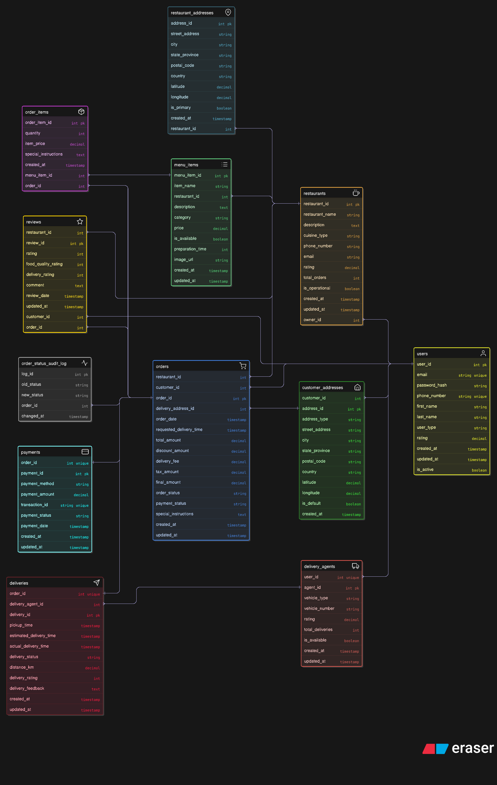

# Food Delivery System Database Design (PostgreSQL)

## 📌 Project Overview
This project is a complete PostgreSQL database design for a real-world food delivery platform similar to Swiggy or Zomato. It covers core schema design, advanced database features, sample data generation, and complex analytical queries.

The project demonstrates strong fundamentals in relational database design and advanced SQL development.

---

## 🛠 Tech Stack
- PostgreSQL
- SQL
- Python

---

## 🗂 Project Structure

| Folder | Description |
|--------|------------------------------|
| schema/ | Core database tables and relationships |
| advanced_features/ | Views, functions, procedures, triggers |
| data/ | Dummy data for testing |
| queries/ | Business and analytical SQL queries |

---

## 📐 ER Diagram

---

## 🧱 Database Schema

The schema includes:

- users
- customer_addresses
- restaurants
- restaurant_addresses
- menu_items
- orders
- order_items
- delivery_agents
- deliveries
- payments
- reviews

All tables are normalized and connected using primary and foreign key constraints.

Schema file:

[db_schema.sql](schema/db_schema.sql)

---

## ⚙️ Advanced Database Features

This project implements real production-level features using:

- Views
- User-defined functions
- Stored procedures
- Triggers

These are available in:

[adv_features.sql](advanced_features/adv_features.sql)

Examples:

- Automatic order total calculation using triggers
- Revenue aggregation using views
- Reusable business logic using functions

---

## 📊 Sample Data

Dummy data is generated to simulate real application usage.
We are generating csv files with `Python` scripts and then copying them in our db.

This allows anyone to recreate the database environment locally.

---

## 📈 Analytical SQL Queries

Business-oriented queries such as:

- Top performing restaurants
- Monthly revenue trends
- Most active customers
- Order distribution by city

Available in:

[food_deliveries_sql_queries.sql](queries/food_delivery_sql_queries.sql)

---

## ▶️ How to Run the Project Locally

1. Create database

2. Load schema

3. Generate and Load sample data

3. Load advanced features

Now the database is fully ready for testing queries.

---

## 🎯 Learning Outcomes

- Relational schema design
- Normalization and constraints
- Advanced PostgreSQL programming
- Views, functions, procedures, triggers
- Complex joins and aggregations
- Business analytics using SQL

---

## 👤 Author

Abhishek Kumar  
Aspiring Cloud & Data Engineer
